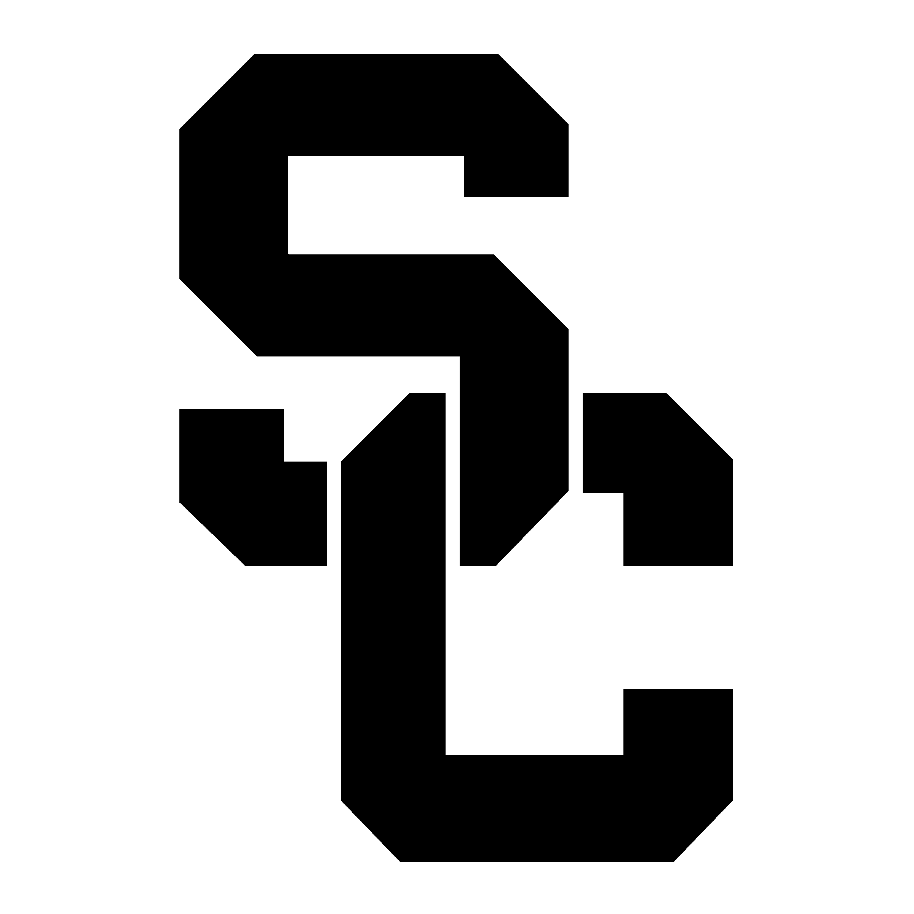

<!-- 
	***
	*   README.md
	*	
	*	Author: Jeong Hoon (Sian) Choi
	*	License: MIT
	*	
	***
-->

 

	
	<h3 align="center">DSCI-565: Introduction to Deep Learning for Data Science</h3>	
	
	
	
	
	
	
	

	University of Southern California 
    Viterbi School of Engineering
	 
	 
	<a href="https://github.com/DSCI-565">
		<strong>Explore the docs »</strong>
	</a>
	 
	 
	<a href="https://github.com/DSCI-565/issues/new?labels=bug&template=bug-report---.md">Report Bug</a>
	·
	<a href="https://github.com/DSCI-565/issues/new?labels=enhancement&template=feature-request---.md">Request Feature</a>
	

## Homework

## Project

## 🔐 License

Copyright © 2025, *Jeong Hoon Choi* or *Sian*. All rights reserved
Distributed under the MIT License. See `LICENSE` for more information.

(<a href="#readme-top">back to top</a>)

## 📞 Contact

Jeong Hoon (Sian) Choi - [@csian98](https://instagram.com/csian98) - [csian7386@gmail.com](mailto:csian7386@gmail.com)

Project Link: [https://github.com/DSCI-565](https://github.com/DSCI-565)

